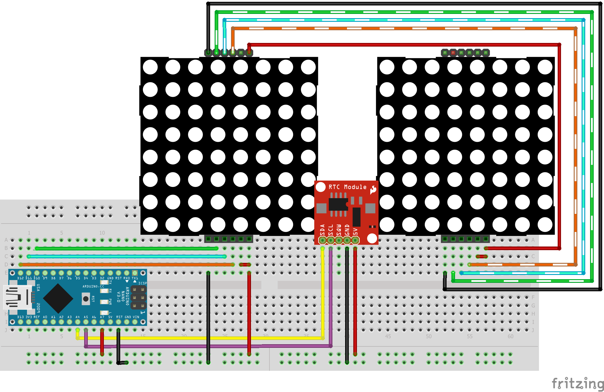

# AcidClock

Minimalist RTC (DS3231) clock.    
Displaying in two MAX7219 led matrices.    
Feedback of complete date and temperature from Serial (USB).    
All based on Arduino Nano (see diagram bellow).    

## Wiring:
USE A GENERIC DS3231 CLOCK MODULE.

