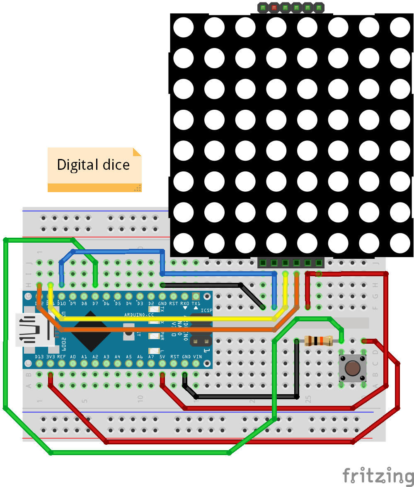

# :game_die: DigDice :game_die:

Digital Dice.    
A simple game dice with Arduino and a MAX7219 8x8 led matrix.

### Usage:
- :pensive: Upload this on your Arduino (anyone).
- :weary: Make connections like diagram bellow.
- :smile: Push the button!    
 :game_die: :game_die: :game_die: :game_die: :game_die: :game_die: :game_die: :game_die: :game_die: :game_die:

### Wiring:

