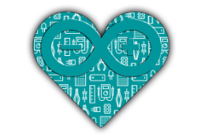

# 
# Arduino fun index of DEPlayground
***
## Team
Github | Name | site
------ | ---- | ----
@ShyPixie | Lara Maia | http://lara.click
@Acidhub | Fernando Manfredi | http://acidhub.click
***
## Projects
Name | Creator | Description
---- | ------- | ----
[ShyBot](../../../ShyBot) | @ShyPixie | A **powerful** autonomous sonar (ultrasonic) based **tank** robot.
[AcidBots](../../../AcidBots) | @Acidhub | Projects **beta** and **gamma** (controled and autonomous car robots)
[DigDice](../../../DigDice) | @Acidhub | Digital dice/roulette (random 1...10)
[AcidClock](../../../AcidClock) | @Acidhub | DS3231, MAX7219 and **Arduino Clock**
[BinaryClock](../../../BinaryClock) | @Acidhub | Simple binary clock (Led Matrix display)
[ArduinoISP](../../../ArduinoISP) | @Acidhub | Arduino as ISP instructions, wiring and code (same code in official Arduino IDE)
[RTCDuino](../../../RTCDuino) | @Acidhub | DS3231 set/read (WIP)
***
```ALL WE PRODUCE IS PROVIDED "AS IS", WITHOUT WARRANTY OF ANY KIND, EXPRESS OR IMPLIED, INCLUDING BUT NOT LIMITED TO THE WARRANTIES OF MERCHANTABILITY, FITNESS FOR A PARTICULAR PURPOSE AND NONINFRINGEMENT. IN NO EVENT SHALL THE AUTHORS OR COPYRIGHT HOLDERS BE LIABLE FOR ANY CLAIM, DAMAGES OR OTHER LIABILITY, WHETHER IN AN ACTION OF CONTRACT, TORT OR OTHERWISE, ARISING FROM, OUT OF OR IN CONNECTION WITH THE SOFTWARE OR THE USE OR OTHER DEALINGS IN OUR WORK.```
